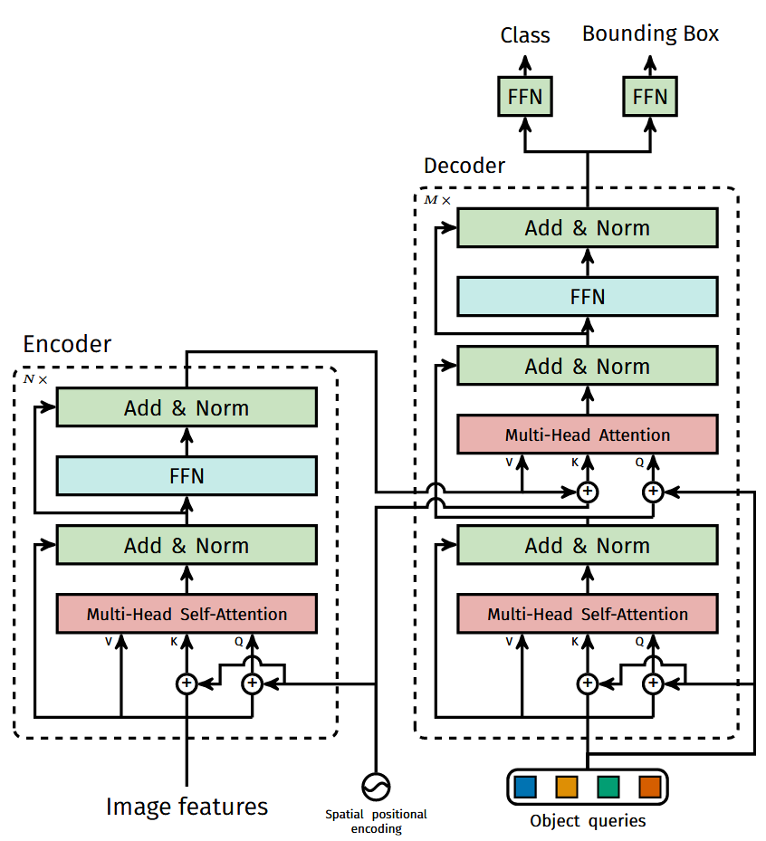
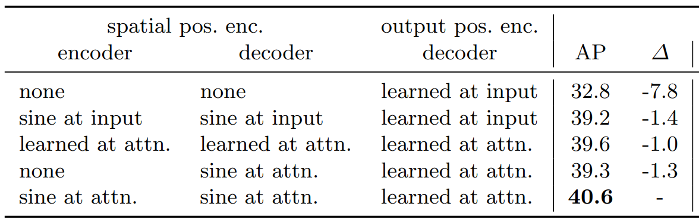
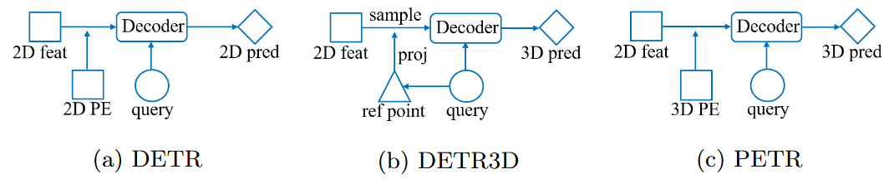
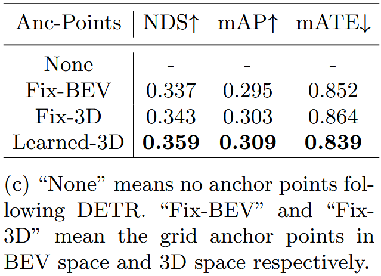

# 目标检测新范式

## DETR
DETR开启了基于Transformer检测器的新时代，其重要意义是：去掉NMS真正做到了端到端的目标检测。两个创新点：1）将目标检测变成集合预测问题，使用二分匹配loss，2）Object query。

### DETR模型结构
DETR的模型结构很简洁，见图1，DETR模型的重点在decoder部分，后续的工作也都是在改进decoder部分，encoder部分使用ViT或者CNN提取特征并不重要。

<div style="text-align: center">
    <figure style="display: inline-block">
        
        <figcaption>Fig.1 DETR模型结构</figcaption>
    </figure>
</div>

### DETR代码细节

在代码的实现中，`query_embed`就是object query，是`DETR`模型的属性，与`transformer`属性并列，它是使用`nn.Embedding`随机初始化的`num_queries x hidden_dim`的向量。

DETR中的`Transformer`并不是标准的transformer，尤其是position encoding部分：标准的transformer中positional encoding是只在第一次输入时候加上去，DETR Decoder中的position encoding有两种，一个是图片中的sine position encoding，在cross attention处加到图片的key中，value没有加，另一个是使用object query (`query_embed`)加到decoder的query上，两种position encoding在每个decoder layer都加，而不是只加在第一次输入上。

在`Transformer`类中，`forward`函数如下，细节是`tgt`的初始化全部为0，并且是每次的forward都是从0开始，这一点在后续的工作被改成随机初始化，和oject query一起初始化。

```python
def forward(self, src, mask, query_embed, pos_embed):
    # flatten NxCxHxW to HWxNxC
    bs, c, h, w = src.shape
    src = src.flatten(2).permute(2, 0, 1)
    pos_embed = pos_embed.flatten(2).permute(2, 0, 1) # sine postion encoding
    query_embed = query_embed.unsqueeze(1).repeat(1, bs, 1) # object query in paper
    mask = mask.flatten(1)

    tgt = torch.zeros_like(query_embed)
    memory = self.encoder(src, src_key_padding_mask=mask, pos=pos_embed)
    hs = self.decoder(tgt, memory, memory_key_padding_mask=mask,
                        pos=pos_embed, query_pos=query_embed)
    return hs.transpose(1, 2), memory.permute(1, 2, 0).view(bs, c, h, w)
```
接着，我们来看下`TransformerDecoder`的`forward`函数：
```python
def forward(self, 
            tgt, # decoder中的query
            memory, # transformer encoder的输出
            tgt_mask: Optional[Tensor] = None,
            memory_mask: Optional[Tensor] = None,
            tgt_key_padding_mask: Optional[Tensor] = None,
            memory_key_padding_mask: Optional[Tensor] = None,
            pos: Optional[Tensor] = None,
            query_pos: Optional[Tensor] = None):
        
        output = tgt

        for layer in self.layers:
            # output decoder每层都和图片全局特征交互，更新query
            output = layer(output, memory, tgt_mask=tgt_mask,
                           memory_mask=memory_mask,
                           tgt_key_padding_mask=tgt_key_padding_mask,
                           memory_key_padding_mask=memory_key_padding_mask,
                           pos=pos, query_pos=query_pos)

        return output.unsqueeze(0)
```
继续，看下`TransformerDecoderLayer`中的`forward`函数：
```python
def forward_pre(self, 
                tgt, 
                memory,
                tgt_mask: Optional[Tensor] = None,
                memory_mask: Optional[Tensor] = None,
                tgt_key_padding_mask: Optional[Tensor] = None,
                memory_key_padding_mask: Optional[Tensor] = None,
                pos: Optional[Tensor] = None,
                query_pos: Optional[Tensor] = None):

        tgt2 = self.norm1(tgt)
        # 在decoder中的第一层self attn使用object query更新前一层的输出tgt(tgt是目标query)
        q = k = self.with_pos_embed(tgt2, query_pos) 
        tgt2 = self.self_attn(q, k, value=tgt2, attn_mask=tgt_mask,
                              key_padding_mask=tgt_key_padding_mask)[0]
        tgt = tgt + self.dropout1(tgt2)
        tgt2 = self.norm2(tgt)
        tgt2 = self.multihead_attn(query=self.with_pos_embed(tgt2, query_pos),
                                   key=self.with_pos_embed(memory, pos),
                                   value=memory, attn_mask=memory_mask,
                                   key_padding_mask=memory_key_padding_mask)[0]
        tgt = tgt + self.dropout2(tgt2)
        tgt2 = self.norm3(tgt)
        tgt2 = self.linear2(self.dropout(self.activation(self.linear1(tgt2))))
        tgt = tgt + self.dropout3(tgt2)
        return tgt
```

### DETR中的object query
DETR开创了使用query从图片特征中聚合目标特征然后从query中解码目标框的范式，是关注的重点，但是论文中的object query**奇怪**的是起到了类似position embedding的作用。
object query 在论文中是这样描述的：

> Since the decoder is also permutation-invariant, the N input embeddings must be different to produce different results. These input embeddings are learnt positional encodings that we refer to as object queries.

这里的并object query不是模型在最后解码出目标框的query，这里的命名有一些歧义，我觉得称为object learnable position encoding更好。object query像上面模型结构图中所示，加到每个decoder的q上面。最后使用q来解码目标框。

那问题是object query它起到什么作用？学到了什么？

第一个问题，decoder的q一定需要position encoding，原因是q需要不同才能产生不同的结果，它可以是固定的sine position encoding嘛？不可以，因为和图像的结构化数据不同(像素位置都是固定的)，目标物体出现在不同图像上的位置非常不同，那么需要一个可学习的位置编码。论文中object query起到的作用就是对q的位置编码。
作者在论文中对position encoding做了消融实验，对于object query采取了两种策略，一是只在decoder的初始时加在q上，另一种是在每层都加，两种实验相差$1.4$个点，并不是特别大，但是作者并没有尝试不加object query或者固定的sine position encoding。

<div style="text-align: center">
    <figure style="display: inline-block">
        
        <figcaption>Fig.2 DETR position encoding 消融实验</figcaption>
    </figure>
</div>

第二个问题，object query到底学到了什么？object query的作用是位置编码。其实真正疑惑的可能是decoder的q到底学到了什么。我的感觉是它很像是anchor，是非常灵活、抽象、可学习的anchor，是一种数据集中目标物体的查询向量，利用transformer它可以从图像的全局特征中检索目标物体信息，它可能学到的信息：
- 目标物体的抽象特征
- 数据集中常见物体的统计规律
- 目标物体位置敏感的特征
- 类别相关的先验知识

**之后的object query都表示的是decoder的q，而不是DETR中position encoding的object query。**

### 为什么DETR中不在需要后处理NMS？
这就涉及到了decoder self-attention作用，decoder中的q在进入decoder layer中后先进行self-attention，再进行和图像特征进行cross attention。
那这层self-attention是否必要呢？论文在消融实验表明self-attention起到了消除冗余预测框的作用(duplicate prediction)，并且需要多层的decoder layer足以消除重复预测，单层的decoder layer不足以做到。

## DETR3D
DETR3D是DETR使用在3D目标检测的开篇工作。简单来说：
- 使用一组object query来预测一组三维参考点(目标框中心点)：$c_{li}=\Phi^{ref}(\mathbf{q}_{li}) \in \mathbb{R^3}$
- 参考点投影到图像的像素位置：$c_{lmi}=P\cdot c_{li}$
- 根据参考点像素从多尺度的图像特征中采样：$\mathbf{f}_{lkmi}=f^{bilinear}(F_{img, c_{lmi}}) \rightarrow f_{li}=\sum_{k}\sum_{m}\mathbf{f}_{lkmi}$
- 和object query进行融合：$\mathbf{q}_{(l+1)i}=\mathbb{f}_{li}+\mathbf{q}_{li}$
- 得到的object query在下一层中进行self attention

### DETR3D详细解读

#### `DETR3DHead`
在`DETR3DHead`类控制DETR3D的所有逻辑，在`DETR3DHead`初始化时候，`query_embedding = nn.Embedding(num_query, embed_dims * 2)`，`query_embedding`的前半部分是`query_pos`(相当于DETR中的object query)，后半部分是`query`。
它的`forward`函数接受提取的图像多尺度特征和图像信息，进入后马上通过transformer（类型是`Detr3DTransformer`），得到object query（代码中的`hs`）和参考点。

[TODO]我的理解是DETR3D对每个图像特征尺度下预测一属于这个尺度下的目标框。

`DETR3DHead`的代码：
```python
def forward(self, mlvl_feats, img_metas):   
    hs, init_reference, inter_references = self.transformer(
        mlvl_feats,
        query_embeds,
        reg_branches=self.reg_branches if self.with_box_refine else None,  # noqa:E501
        img_metas=img_metas,
    )
    hs = hs.permute(0, 2, 1, 3)
    outputs_classes = []
    outputs_coords = []

    for lvl in range(hs.shape[0]):
        if lvl == 0:
            reference = init_reference
        else:
            reference = inter_references[lvl - 1]
        reference = inverse_sigmoid(reference)
        outputs_class = self.cls_branches[lvl](hs[lvl])
        tmp = self.reg_branches[lvl](hs[lvl])

        # TODO: check the shape of reference
        assert reference.shape[-1] == 3
        tmp[..., 0:2] += reference[..., 0:2]
        tmp[..., 0:2] = tmp[..., 0:2].sigmoid()
        tmp[..., 4:5] += reference[..., 2:3]
        tmp[..., 4:5] = tmp[..., 4:5].sigmoid()
        tmp[..., 0:1] = (tmp[..., 0:1] * (self.pc_range[3] - self.pc_range[0]) + self.pc_range[0])
        tmp[..., 1:2] = (tmp[..., 1:2] * (self.pc_range[4] - self.pc_range[1]) + self.pc_range[1])
        tmp[..., 4:5] = (tmp[..., 4:5] * (self.pc_range[5] - self.pc_range[2]) + self.pc_range[2])

        # TODO: check if using sigmoid
        outputs_coord = tmp
        outputs_classes.append(outputs_class)
        outputs_coords.append(outputs_coord)

    outputs_classes = torch.stack(outputs_classes)
    outputs_coords = torch.stack(outputs_coords)
    outs = {
        'all_cls_scores': outputs_classes,
        'all_bbox_preds': outputs_coords,
        'enc_cls_scores': None,
        'enc_bbox_preds': None, 
    }
    return outs
```

#### `Detr3DTransformer`
`DETR3DHead`中的transformer使用的`Detr3DTransformer`，它的主要组成是decoder，类型是`Detr3DTransformerDecoder`，以及用于预测参考点的线性层`reference_points`。

`Detr3DTransformer`接受多尺度的图像特征`mlvl_feats`和`query_embed`：
- 第一步，先从query中预测(`self.reference_points`是一层线性层)一组参考点：这里使用的是query_pos，也就是position encoding来预测。
  - 这点让我感到有些意外，因为最终是从query中解码物体中心框的，为什么这里使用query pos来预测？
- 第二步，给到decoder(`Detr3DTransformerDecoder`)。

在`Detr3DTransformer`的`forward`函数：
```python
def forward(self,
            mlvl_feats,
            query_embed,
            reg_branches=None,
            **kwargs):
    bs = mlvl_feats[0].size(0)
    query_pos, query = torch.split(query_embed, self.embed_dims , dim=1)
    query_pos = query_pos.unsqueeze(0).expand(bs, -1, -1)
    query = query.unsqueeze(0).expand(bs, -1, -1)
    reference_points = self.reference_points(query_pos) # 从query_pos中预测参考点
    reference_points = reference_points.sigmoid()
    init_reference_out = reference_points

    query = query.permute(1, 0, 2)
    query_pos = query_pos.permute(1, 0, 2)
    inter_states, inter_references = self.decoder(
        query=query, key=None, value=mlvl_feats,
        query_pos=query_pos,
        reference_points=reference_points,
        reg_branches=reg_branches,
        **kwargs)

    inter_references_out = inter_references
    return inter_states, init_reference_out, inter_references_out
```

`Detr3DTransformerDecoder`的`forward`函数：
```python
def forward(self,
            query,
            *args,
            reference_points=None,
            reg_branches=None, 
            **kwargs)
    output = query
    for lid, layer in enumerate(self.layers):
        reference_points_input = reference_points
        output = layer(output, *args, reference_points=\
            reference_points_input, **kwargs)
        output = output.permute(1, 0, 2)

        # with_box_refine == True
        # 我理解最上层使用一层线性层从query_pos来预测reference points应该不是很准确
        # 因此这里使用每层的输出的query来更新reference points的预测
        if reg_branches is not None:
            tmp = reg_branches[lid](output)            
            assert reference_points.shape[-1] == 3
            new_reference_points = torch.zeros_like(reference_points)
            new_reference_points[..., :2] = \
                tmp[.., :2] + inverse_sigmoid(reference_points[..., :2])
            new_reference_points[..., 2:3] = \
            tmp[.., 4:5] + inverse_sigmoid(reference_points[..., 2:3])
        
            new_reference_points = new_reference_points.sigmoid()
            reference_points = new_reference_points.detach()

        output = output.permute(1, 0, 2)

    return output, reference_points
```

#### `Detr3DTransformerDecoder`
decoder使用`build_transformer_layer_sequence`来构建，它使用config文件中的配置进行，它使用默认的self-attention和自定义的Detr3DCrossAttention。
```python
transformerlayers=dict(
                    type='DetrTransformerDecoderLayer',
                    attn_cfgs=[dict(type='MultiheadAttention', ...),
                                dict(type='Detr3DCrossAtten',...)],
                    operation_order=('self_attn', 'norm', 'cross_attn', 'norm', 'ffn', 'norm')),
                    ...
```
主要的工作都发生在`Detr3DCrossAtten`中，它主要包含了`attention_weights`的线性层，q输出前的投影层`output_proj`，以及对参考点的高维映射`position_encoder`(论文里面并没有提及)

`Detr3DCrossAtten`的`forward`函数
```python
def forward(self,
            query,
            key,
            value,
            residual=None,
            query_pos=None,
            key_padding_mask=None,
            reference_points=None,
            spatial_shapes=None,
            level_start_index=None,
            **kwargs):
    if residual is None:
            inp_residual = query
    if query_pos is not None:
        query = query + query_pos
    query = query.permute(1, 0, 2)
    bs, num_query, _ = query.size()

    # 这里的attention_weights在论文中也并没有提到
    attention_weights = self.attention_weights(query).view(
        bs, 1, num_query, self.num_cams, self.num_points, self.num_levels)
    
    reference_points_3d, output, mask = feature_sampling(
        value, reference_points, self.pc_range, kwargs['img_metas'])
    output = torch.nan_to_num(output)
    mask = torch.nan_to_num(mask)
    
    attention_weights = attention_weights.sigmoid() * mask
    output = output * attention_weights
    output = output.sum(-1).sum(-1).sum(-1)
    output = output.permute(2, 0, 1)
    
    output = self.output_proj(output)
    # 对3维参考点的位置编码，有些像PETR，论文中没有提到
    pos_feat = self.position_encoder(inverse_sigmoid(reference_points_3d)).permute(1, 0, 2)
    # 下面是融合上一层的query和这一层根据参考点从图片特征采样得到的特征，另外加上了对参考点3维位置的编码
    return self.dropout(output) + inp_residual + pos_feat
```

`feature_sampling`函数实现三维参考点在多尺度图像特征上的采样：
```python
def feature_sampling(mlvl_feats, reference_points, pc_range, img_metas):
    lidar2img = []
    for img_meta in img_metas:
        lidar2img.append(img_meta['lidar2img'])
    lidar2img = np.asarray(lidar2img)
    lidar2img = reference_points.new_tensor(lidar2img) # (B, N, 4, 4)
    reference_points = reference_points.clone()
    reference_points_3d = reference_points.clone()
    # 把根据query_pos预测的、归一化的参考点还原回真实距离，准备投影
    reference_points[..., 0:1] = reference_points[..., 0:1]* \
        (pc_range[3] - pc_range[0]) + pc_range[0]
    reference_points[..., 1:2] = reference_points[..., 1:2]* \
        (pc_range[4] - pc_range[1]) + pc_range[1]
    reference_points[..., 2:3] = reference_points[..., 2:3]* \
        (pc_range[5] - pc_range[2]) + pc_range[2]
    # reference_points (B, num_queries, 4)
    reference_points = torch.cat((reference_points, \ 
        torch.ones_like(reference_points[..., :1])), -1)
    B, num_query = reference_points.size()[:2]
    num_cam = lidar2img.size(1)
    reference_points = reference_points.view(B, 1, num_query, 4).repeat(1, num_cam, 1, 1).unsqueeze(-1)
    lidar2img = lidar2img.view(B, num_cam, 1, 4, 4).repeat(1, 1, num_query, 1, 1)
    # 投影到像素
    reference_points_cam = torch.matmul(lidar2img, reference_points).squeeze(-1)
    eps = 1e-5
    mask = (reference_points_cam[..., 2:3] > eps)
    reference_points_cam = reference_points_cam[..., 0:2] / torch.maximum(
        reference_points_cam[..., 2:3], torch.ones_like(reference_points_cam[..., 2:3])*eps)
    # 为grid_sample把像素值映射到[-1, 1]
    reference_points_cam[..., 0] /= img_metas[0]['img_shape'][0][1]
    reference_points_cam[..., 1] /= img_metas[0]['img_shape'][0][0]
    reference_points_cam = (reference_points_cam - 0.5) * 2
    mask = (mask & (reference_points_cam[..., 0:1] > -1.0) 
                 & (reference_points_cam[..., 0:1] < 1.0) 
                 & (reference_points_cam[..., 1:2] > -1.0) 
                 & (reference_points_cam[..., 1:2] < 1.0))
    mask = mask.view(B, num_cam, 1, num_query, 1, 1).permute(0, 2, 3, 1, 4, 5)
    mask = torch.nan_to_num(mask)
    sampled_feats = []
    # 
    for lvl, feat in enumerate(mlvl_feats):
        B, N, C, H, W = feat.size()
        feat = feat.view(B*N, C, H, W)
        reference_points_cam_lvl = reference_points_cam.view(B*N, num_query, 1, 2)
        # 对每个reference point采样图像特征
        sampled_feat = F.grid_sample(feat, reference_points_cam_lvl)
        sampled_feat = sampled_feat.view(B, N, C, num_query, 1).permute(0, 2, 3, 1, 4)
        sampled_feats.append(sampled_feat)
    sampled_feats = torch.stack(sampled_feats, -1)
    sampled_feats = sampled_feats.view(B, C, num_query, num_cam,  1, len(mlvl_feats))
    return reference_points_3d, sampled_feats, mask
```


## PETR系列
PETR系列和DETR系列的对比可以从PETR论文中比较清晰的看到，PETR在三维空间做了3D Position Encoding，并且也在query的生成上做前作进行了改进。

> PETR由于对整个三维空间进行了position encoding，并且也是使用object query对所有的图像特征做global attention，也算是很稠密的计算，并没有发挥sparse query的优势。

<div style="text-align: center">
    <figure style="display: inline-block">
        
        <figcaption>Fig.3 PETR与DETR和DETR3D的比较</figcaption>
    </figure>
</div>

### PETRv1

#### 3D Position Generator
Step 1: 生成3维空间的meshgrid：$p_j^m=(u_j \times d_j, v_j \times d_j, d_j)^T$，其中$d_j$是深度，这些点是在相机坐标系下的.

Step 2: 将所有相机的meshgrid投影到世界坐标系下：$p_{i,j}^{3d}=K_{i}^{-1}(p_j^m, 1)$，$i$表示的是相机

Step 3: 对所有点$p^{3d}$在ROI区域进行归一化，得到$P^{3d}_i \in R^{(D\times 4)\times H \times W}$，其中的$D\times 3$表示的是Depth维度和坐标的3维度.

#### 3D Position Encoder
3D Position Encoder对3D位置进行编码，并和图像特征进行融合：$F_i^{3d}=\phi(F_i^{2d}, P_i^{3d}) \in R^{C \times H \times W}$

第一步是对$P^{3d}$进行编码，文中使用了MLP对位置进行编码，得到3D PE (Position Embedding)，但是$P^{3d}$位置是$D\times 3$的，如何维度是$C$的位置编码呢？
代码中，将$D\times 3$展平：$coords3d = coords3d.reshape(B, -1, D*3)$，并且使用MLP组成的`position_encoder`对位置进行编码。另外，也可以看到position_encoder的细节是`position_dim = depth_num * 3`。

#### Query Generator
和前作object query使用随机初始化不同，这里是随机初始化anchor points，再将anchor points输入到一个小的MLP来得到初始的object query $Q_0$。作者对比的是DETR的随机初始化，和固定的anchor points初始化，以及可学习的anchor points初始化。
<div style="text-align: center">
    <figure style="display: inline-block">
        
        <figcaption>Fig.4 PETR Query Generator消融实验</figcaption>
    </figure>
</div>

### StreamPETR

## Sparse4D系列
